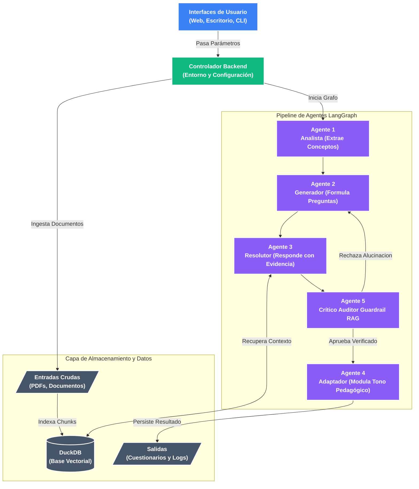

# Contextual QnA Extractor

Sistema RAG (Retrieval-Augmented Generation) multi-agente construido sobre Ollama y LangGraph. Ingiere documentos en diversos formatos (PDF, Word, Markdown, texto plano, imágenes) y genera cuestionarios contextuales adaptados a perfiles de audiencia específicos (ej. estudiante universitario, técnico, principiante), preservando estrictamente la trazabilidad de las fuentes.

## Arquitectura del Sistema

La arquitectura aísla la orquestación, la ingesta de datos y el flujo de agentes para facilitar la escalabilidad y las pruebas.



## Estructura del Repositorio

- `inputs/`: Directorio para documentos fuente crudos.
- `outputs/`: 
  - `processed/`: Conversiones Markdown y la base de datos vectorial DuckDB.
  - `cuestionarios-logs/`: Cuestionarios finales generados en Markdown y registros de ejecución.
- `prompts/`: Plantillas de texto plano que dictan el comportamiento de los agentes. Desacopladas del código fuente para permitir ajustes sin modificar la lógica.
- `Python/`: Arquitectura modular central que contiene el controlador, esquemas, herramientas RAG, agentes, lógica del grafo y puntos de entrada de la interfaz de usuario (`gui_app.py`, `web_app.py`).
- `sh/`: Scripts de inicialización (`bash` y `powershell`) para ejecución vía CLI.
- `docs/`: Documentación del sistema y planes arquitectónicos.

## Registro de Ejecución (Datos de Entrenamiento)

Para soportar el futuro fine-tuning de modelos y la depuración del sistema, se captura el estado completo de ejecución del LLM (prompts exactos, respuestas crudas, contextos y errores) en todas las ejecuciones.

Los registros se centralizan en `outputs/logs/`:
- `dataset_training.log`: Archivo de texto estructurado legible por humanos. Útil para la auditoría manual de los pasos de razonamiento de los agentes.
- `dataset_training.jsonl`: Formato estricto JSON Lines con datos idénticos. Formato estándar para ingesta directa en pipelines de entrenamiento de ML (ej. HuggingFace datasets, OpenAI fine-tuning).

## Requisitos Previos

1. **Entorno Python**: Asegurar que el entorno local esté activo y las dependencias instaladas (`pip install -r requirements.txt`).
2. **Ollama**: Una instancia local de [Ollama](https://ollama.com/) debe estar en ejecución con los modelos requeridos descargados (ej. `llama3.1`, `gemma2`, `mistral`, `gemma4:e2b`).

## Configuración de Rutas

Las rutas se resuelven desde `Python/config.py`, por lo que el sistema funciona igual aunque se ejecute desde la raíz del proyecto, `Python/` o `sh/`. Por defecto usa las carpetas incluidas en el repositorio. Para cambiar su ubicación, define estas variables antes de iniciar la aplicación; las rutas relativas se interpretan respecto a `CONTEXTUAL_QNA_PROJECT_DIR`.

| Variable | Valor por defecto |
|---|---|
| `CONTEXTUAL_QNA_PROJECT_DIR` | raíz detectada automáticamente |
| `CONTEXTUAL_QNA_INPUTS_DIR` | `inputs` |
| `CONTEXTUAL_QNA_OUTPUTS_DIR` | `outputs` |
| `CONTEXTUAL_QNA_PROMPTS_DIR` | `prompts` |
| `CONTEXTUAL_QNA_PROCESSED_DIR` | `outputs/processed` |
| `CONTEXTUAL_QNA_LOGS_DIR` | `outputs/cuestionarios-logs` |
| `CONTEXTUAL_QNA_SQUAD_DATASET` | `train-v2.0.json` |
| `CONTEXTUAL_QNA_SQUAD_SAMPLES_DIR` | `inputs/squad_samples` |
| `OLLAMA_MODELS` | `ollama_models` |
| `HF_HOME` | `huggingface_cache` |

Ejemplos:

```bash
export CONTEXTUAL_QNA_INPUTS_DIR="/datos/qna/entradas"
export CONTEXTUAL_QNA_OUTPUTS_DIR="/datos/qna/salidas"
export OLLAMA_MODELS="/datos/ollama/models"
```

```powershell
$env:CONTEXTUAL_QNA_INPUTS_DIR = "D:\Datos\QnA\entradas"
$env:CONTEXTUAL_QNA_OUTPUTS_DIR = "D:\Datos\QnA\salidas"
$env:OLLAMA_MODELS = "D:\Ollama_Modelos"
```

También se aceptan rutas absolutas para el dataset SQuAD y la caché de Hugging Face. Si no se define ninguna variable, no es necesario modificar el código al cambiar de Windows a Linux.

## Métodos de Ejecución

Todos los comandos deben ejecutarse desde el directorio raíz del proyecto.

### 1. Interfaz Web
Inicia la aplicación web Streamlit.
```bash
streamlit run Python/web_app.py
```

### 2. Interfaz de Escritorio (GUI)
Inicia la aplicación de escritorio nativa CustomTkinter. Esta interfaz se comunica directamente con los scripts `sh/lanzar_beta` para ejecutar el backend, cumpliendo con los requisitos de integración.

```bash
python Python/gui_app.py
```

**Tutorial de Uso (GUI):**
1. Ejecuta el comando anterior en tu terminal para inicializar la aplicación.
2. Selecciona el botón **"Buscar Archivo"** e ingresa el documento fuente (ej. PDF o TXT).
3. En la sección "Parámetros del Sistema", especifica el **Perfil del Evaluado** (ej. estudiante universitario).
4. Selecciona el **Modelo Ollama LLM** pre-descargado en tu entorno (ej. `llama3.1` o `gemma4:e2b`).
5. Configura el **Número de Preguntas** a generar.
6. Presiona **"GENERAR CUESTIONARIO"** para inicializar el pipeline de agentes.
7. Supervisa la consola de logs incrustada para auditar la extracción de conceptos y resolución de evidencia en tiempo real. Al finalizar, selecciona **"Abrir Carpeta de Logs"** para acceder a los artefactos generados.

### 3. Interfaz de Línea de Comandos (CLI)
Para ejecución sin interfaz gráfica o integración en scripts.

Mediante scripts shell:
```bash
bash sh/lanzar_beta.sh
# o
.\sh\lanzar_beta.ps1
```

Mediante el controlador Python directo:
```bash
python Python/main.py --input "Documento.pdf" --perfil "estudiante universitario" --modelo "llama3.1" --top_n 5
```

---
**Nota de Mantenimiento:** La arquitectura Multi-Agente RAG está completamente operativa, incluyendo el flujo de Guardrail (Agente 5) para mitigar alucinaciones de forma autónoma.
